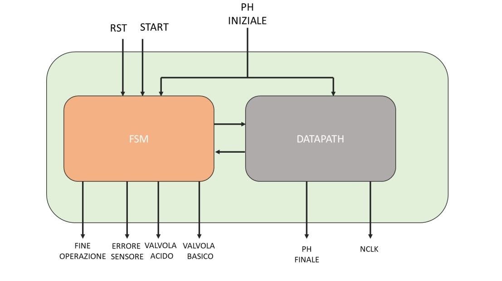

# Progetto FSMD

## Specifiche

Si progetti il circuito che controlla un meccanismo chimico il cui scopo è portare una soluzione iniziale a pH noto (acida o basica) ad un pH di neutralità. Il valore del pH viene espresso in valori compresi tra 0 e 14, i valori superiori a 14 comportano un errore.


Per pH acido si intende un valore strettamente inferiore a 7, mentre per pH basico si intende un valore strettamemnte maggiore a 8, tutti i valori compresi tra [7, 8] sono valori di neutralità.

Le due valvole hanno flussi di erogazione differenti, la valvola relativa alla soluzione basica erroga una quantità che permette di alzare di *0.25* il liquido ad ogno ciclo di clock, mentre la valvola ralativa alla soluzioen acida erroga una quantità che permette di alzare di *0.50* il liquido a ogni ciclo di clock.

### Interfaccia del circuito

Ingressi:

- `RST` (1 bit)

    Il circuito deve tornare allo stato iniziale a partire da un qualsiasi altro non appena riceve il segnale di *rest* uguale a `1`. Inoltre tutte le uscite tornano a `0`.

- `START` (1 bit)

    Il circuito esce dallo stato iniziale solamente quando riceve il segnale di *inizio* uguale ad `1` ed il *pH* iniziale **nello stesso ciclo di clock**.

- `PH` (8 bit)

    Il circuito riceve il segnale *pH*, **codificato in virgola fissa** con `4` bit dedicati alla parte intera (intervallo `[0, 14]`) e i restanti per la parte decimale. In seguito alla comprensione del valore, il sistema decide in quale stato porsi.

Uscite:

- `FINE_OPERAZIONE` (1 bit)

    Questo segnale comunica che la soluzione ha finalmente raggiunto la neutralità, in altre parole diviene uguale ad `1` solamente quando il valore del *pH* è compreso nell'intervallo `[7, 8]`.

- `ERRORE_SENSORE` (1 bit)

    Il segnale indica che il sistema ha ricevuto in ingresso un *pH* non valido, cioè diviene uguale ad `1` solamente quando, insieme al segnale di *inizio*, viene inserito un *pH* `> 14`.

- `VALVOLA_ACIDO` (1 bit)

    Il segnale comunica che è necessario correggere il *pH* della soluzione fornendo ulteriore basicità, diviene uguale ad `1` prettamente quando il circuito è stato di *basico*.

- `VALVOLA_BASICO` (1 bit)

    Il segnale comunica che è necessario correggere il *pH* della soluzione fornendo ulteriore acidità, diviene uguale ad `1` prettamente quando il circuito è stato di *acido*.

- `PH_FINALE` (8 bit)

    Questo segnale rappresenta il valore esatto del *pH* quando il sistema riconosce di aver
    completato le operazioni. Possiede la **medesima codifica** del *pH* in ingresso.

- `NCLK` (8 bit)

    Questo segnale rappresenta il numero di cicli impiegati per raggiungere la neutralità, viene **codificato in modulo**.

## Architettura generale del circuito

Il circuito è composto da un **FSM** (controllore) e un **DATA-PATH** (elaboratore) che comunicano tra loro. I file che contengono la rappresentazione in formato `blif` di questi componenti sono `FSM.blif` e `DATA-PATH.blif` essi sono poi collegati per creare la ***FSMD*** che costituisce il nostro circuito finale.

I componenti sono descritti nel dettaglio nelle pagine seguenti analizzando nello specifico anche le scelte progetturali compiute durante la loro creazione.


<!-- Da sistmare i collegamenti tra FSM e DATA-PATH -->

## Finite State Machine (FSM)

Stati della FSM:

- `Reset`, stato iniziale del circuito
- `Errore`, stato raggiunto in caso di pH invalido
- `Acido`, stato raggiunto in caso di pH acido
- `Basico`, stato raggiunto in caso di pH basico
- `Neutro`, stato raggiunto dopo che il pH ha raggiunto la neutralità

<!-- Inserisci STG -->

## DATA-PATH

Il DATA-PATH è strutturato in 2 parti:

1. Contatore: effetua il conteggio dei cicli di clock che ci vogliono per completare l'operazione;
1. Elaboratore: porta il pH a un livello di neutralità oppure stampa l'errore se la codifica inserita non soddisfa i requisiti.

<!-- Inserisci Datapath -->

## Statistiche del circuito

Quando si prova il circuito vengono stampati dei warning con su scritto *"does not fanot"* sono le uscite dei componenti interni che non vengono portate in output quindi possono essere ingorati.

Le statistiche del circuito prima dell'otimizzazione per area sono:
<!-- SCREEN STATISTICHE -->

Per minimizzare la **FSM** i comandi da eseguire sono:

```sis
state_minimize stamina
state_assign jedi
source script.rugged
source script.rugged
source script.rugged
```

<!-- Da definire -->

## Numero di gate e ritardo

Il numero di gate del circuito è <!-- NUMERO GATE-->.

<!-- Da definire -->

## La descrizione delle scelte progettuali

Durante l'impementazione del progetto abbiamo fatto le seguenti scelte progettuali:

1. Per controllare se il pH è acido oppure basico sfruttiamo il bit più significativo se esso è a 0 allora è acido se è a 1 allora è basico, però questo comprenderebbe che anche i valori neutri vengono assegnati a uno dei due tipi. Per risolvere questo problema abbiamo messo un controllore di neutralità nel DATA-PATH in modo tale che il DATA-PATH comunichi alla FSM di cambiare stato da ***Acido*** oppure ***Basico*** a ***Neutro***.

1. Per controllare l'errore abbiamo aggiunto un componente al DATA-PATH che restituisce uno se e solo se è presente un errore (pH > 14) in questo modo la FSM cambia stato da ***Reset*** a ***Errore***.

1. Se l'utente dallo stato di ***Errore*** oppure ***Neutro*** non inserisce **RST** a *1* la FSM rimane sullo stato in cui si trova.

1. Per semplificare la scrittura e la lettura dei componenti in formato `blif` abbiamo suddiviso il DATA-PATH in più pezzi (`error.blif`, `modifier.blif`, `neutral.blif`, `counter.blif`) che poi abbiamo unito utilizzando i `subckt` e i `search`.

<!-- Da definire -->
