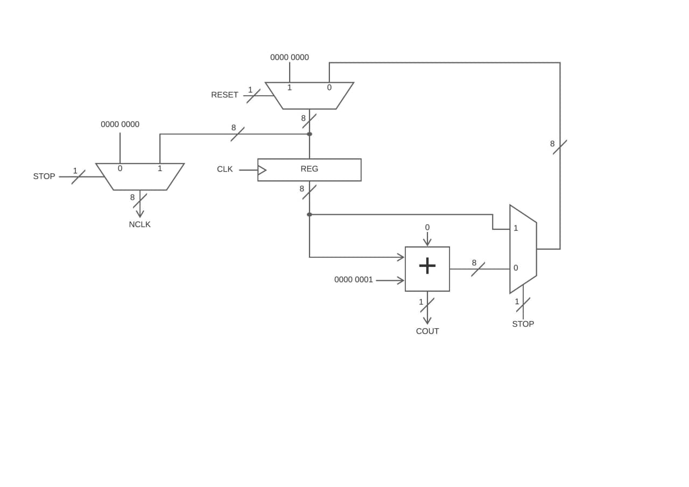
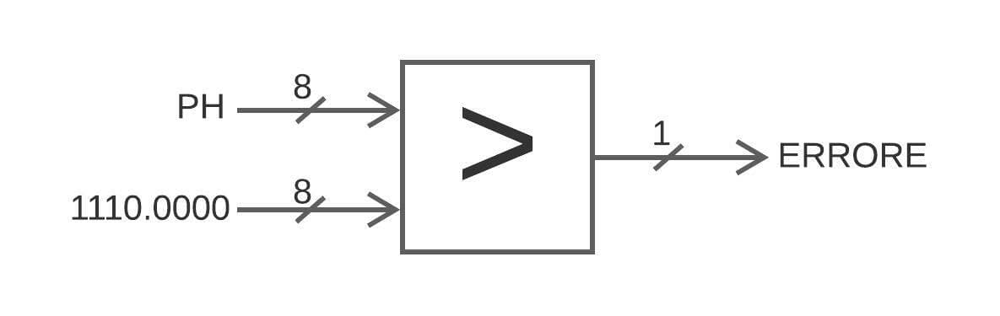
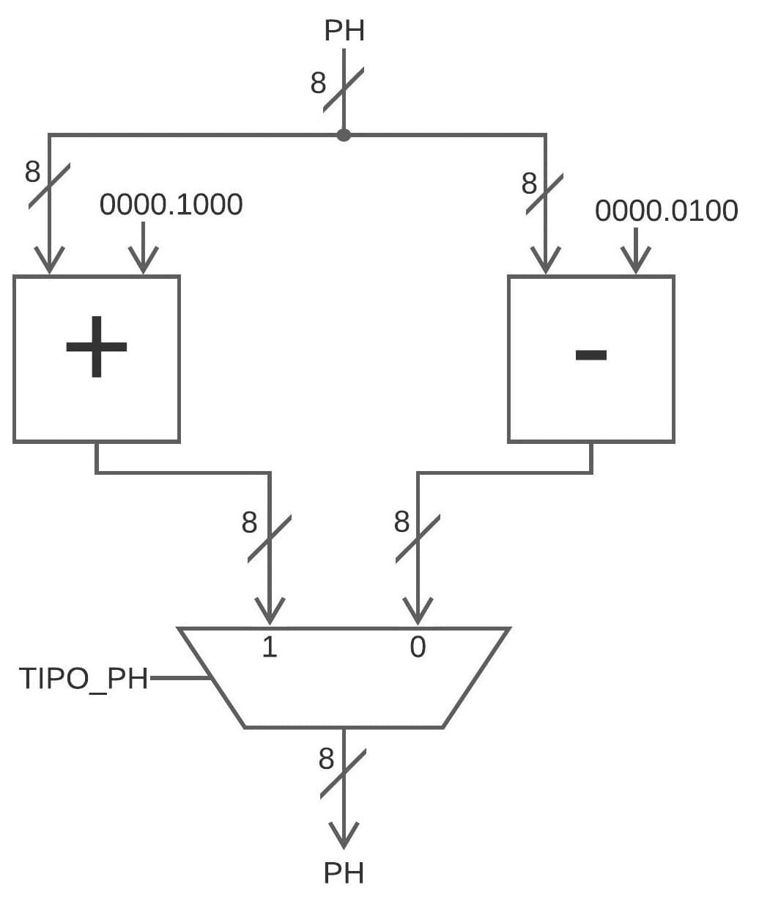
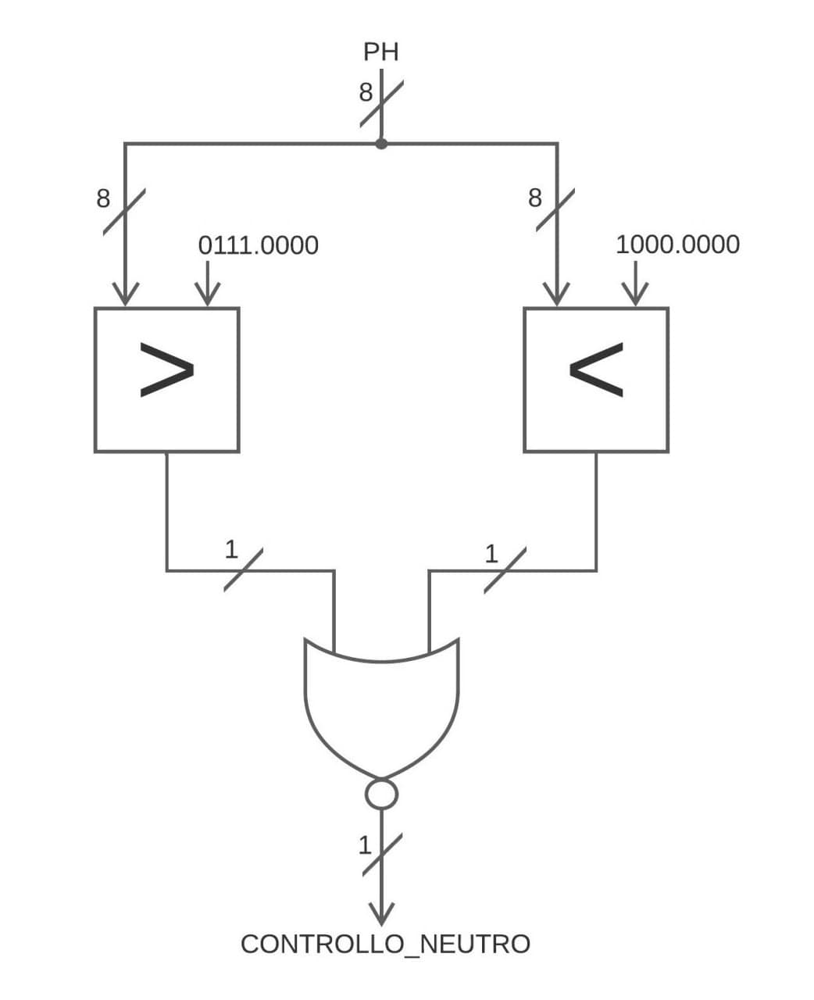
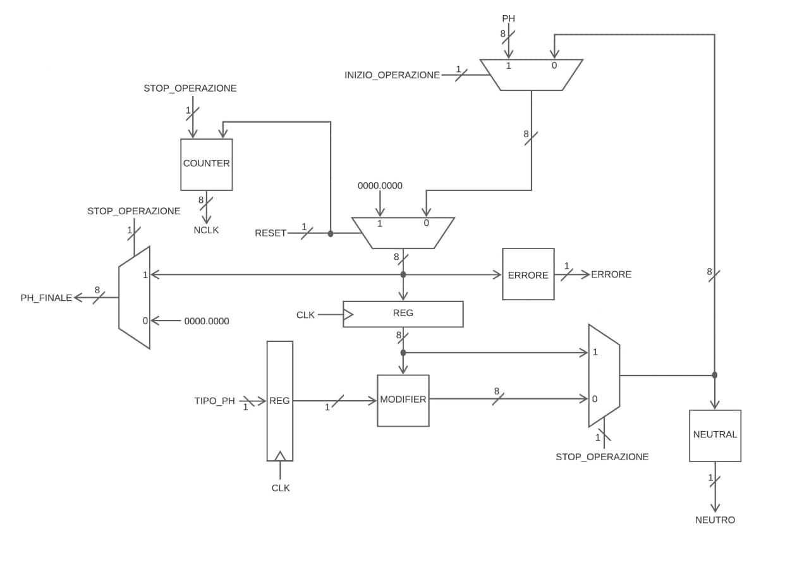

# Circuito FSM + D

Abbiamo sviluppato un circuito che controlla un meccanismo chimico, il cui scopo è portare una soluzione con un pH iniziale noto ad un valore di neutralità.

## Traccia

Il valore del pH viene espresso in valori compresi tra `0.00` e `14.0`: nell'intervallo `[0.00, 7.00)` si trovano i valori acidi, mentre in quello `(8.00, 14.0]` si trovano i valori basici, infine i valori compresi in `[7.00, 8.00]` sono considerati neutrali. Tutti gli altri valori non sono accettabili e comportano un errore.

Il sistema è quindi dotato di due valvole: la prima può *decrementare* il valore del pH di `0.25` in un singolo ciclo di clock, mentre la seconda lo può *incrementare* di `0.50` nello stesso periodo di tempo.

{ width=65% }

### Interfaccia del circuito

Il circuito accetta i seguenti segnali di ingresso:

| **Ingresso**          | **Descrizione**                                                                         |
| --------------------: | :-------------------------------------------------------------------------------------- |
| `RST`                 | Ordina al circuito di tornare allo stato iniziale. Prevale su qualsiasi altro ingresso. |
| `START`               | Ordina al circuito di leggere il valore presente nell'ingresso `PH[8]`.                 |
| `PH[8]`               | Rappresentazione del valore iniziale assunto dal pH della soluzione.                    |

L'ingresso `PH[8]` è un byte codificato in **virgola fissa** con 4 bit dedicati alla parte intera.

Il circuito produce i seguenti segnali di uscita:

| **Uscita**            | **Descrizione**                                                                         |
| --------------------: | :-------------------------------------------------------------------------------------- |
| `FINE_OPER.`          | Indica che il sistema ha completato le operazioni. Ovvero il pH è neutro.               |
| `ERRORE_SENSORE`      | Indica che il sistema ha ricevuto in ingresso un valore di pH non accettabile.          |
| `VALVOLA_ACIDO`       | Richiede l'apertura della valvola che decrementa il valore del pH.                      |
| `VALVOLA_BASICO`      | Richiede l'apertura della valvola che incrementa il valore del pH.                      |
| `PH_FINALE[8]`        | Rappresentazione del valore finale assunto dal pH della soluzione.                      |
| `NCLK[8]`             | Rappresentazione del numero di cicli utilizzati per completare le operazioni.           |

L'uscita `PH_FINALE[8]` è un byte codificato esattamente come l'ingresso `PH[8]`, mentre il byte `NCLK[8]` viene codificato in **modulo**.

---

## Architettura generale

Il sistema implementa il modello ***FSMD***, cioè collega una *macchina a stati finiti* (detta `FSM`) con un'*unità di elaborazione* (chiamata `Data path`). Il compito della macchina a stati è quello di contestualizzare i calcoli eseguiti dall'elaboratore, viceversa quest'ultimo ha il ruolo di aiutare la macchina a determinare in che stato transitare.

<!-- Immagine da sistmare i collegamenti tra FSM e DATA-PATH -->

### Segnali interni

Il collegamento tra i due sottosistemi avviene grazie allo scambio di segnali di stato e controllo; i primi vengono emessi dalla macchina a stati verso l'elaboratore, i secondi seguono il percorso inverso.

I segnali di stato utilizzati sono i seguenti:

| **Segnale**           | **Descrizione**                                                                         |
| --------------------: | :-------------------------------------------------------------------------------------- |
| `RESET`               | Ordina all'elaboratore di reinizializzare i valori.                                     |
| `INIZIO_OPER.`        |  Comunica all'elaboratore che è appena stato inserito un pH.                            |
| `TIPO_PH`             | Permette all'elaboratore di determinare come modificare il pH.                          |
| `STOP_OPER.`          | Comunica all'elaboratore di non modificare i valori memorizzati.                        |

<!--
#### Segnali di controllo

- `ERRORE`: la codifica del *pH* non è valida.
- `NEUTRO`: determina se il *pH* ha raggiunto la neutralità.

## Macchina a stati finiti (FSM)

Abbiamo individuato cinque stati, cioè:

1. `Reset`: stato iniziale, l'elaboratore viene preparato per l'esecuzione.
2. `Errore`: stato raggiunto nel caso in cui viene inserita una codifica del *pH* incettabile.
3. `Acido`: stato raggiunto quando il *pH* della soluzione è acido.
4. `Basico`: stato raggiunto quando il *pH* della soluzione è basico.
5. `Neutro`: stato raggiunto quando il *pH* della soluzione è neutro.

### Transizioni

Ingressi:

```java
RST START PH[8] ERRORE NEUTRO
```

Uscite:

```java
FINE_OPERAZIONE ERRORE_SENSORE VALVOLA_ACIDO VALVOLA_BASICO RESET INIZIO_OPERAZIONE TIPO_PH STOP_OPERAZIONE
```

#### Stato di Reset

##### Ingressi

Quando la macchina riceve in ingresso la combinazione di bit `RST = 0, START = 1` si sposta nello stato di:

- *Errore* se la codifica del *pH* è inaccettabile.
- *Acido* se il bit più significativo del *pH* è `0`.
- *Basico* se il bit più significativo del *pH* è `1`.

Viceversa, quando non riceve tale combinazione rimane nello stato di *Reset*.

##### Uscite

Quando la macchina si sposta in uno degli stati tra *Errore*, *Acido* oppure *Basico*, invia all'elaboratore
il segnale di stato `INIZIO_OPERAZIONE = 1`, con la differenza che:

- *Errore* lancia anche il segnale `ERRORE_SENSORE = 1`.
- *Acido* lancia i segnali `VALVOLA_BASICO = 1, TIPO_PH = 0`.
- *Basico* lancia i segnali `VALVOLA_ACIDO = 1, TIPO_PH = 1`.

Invece quando la macchina rimane sullo stato di *Reset* comunica all'elaboratore di reinizializzare i calcoli
tramite il segnale di stato `RESET = 1`.

| Ingressi       | Stato corrente | Stato prossimo | Uscite     |
| -------------- | -------------- | -------------- | ---------- |
| `1-----------` | `Reset`        | `Reset`        | `000010-0` |
| `00----------` | `Reset`        | `Reset`        | `000010-0` |
| `01--------1-` | `Reset`        | `Errore`       | `010001-0` |
| `010-------0-` | `Reset`        | `Acido`        | `00010100` |
| `011-------0-` | `Reset`        | `Basico`       | `00100110` |

#### Errore

##### Ingressi

La macchina rimane nello stato di *Errore* fintantoché non riceve in input `RST = 1`, allorché si sposta nello stato di *Reset*.

##### Uscite

Nel caso in cui la macchina rimane nello stato di *Errore* lancia il segnale `ERRORE_SENSORE = 1` mentre nel caso in cui si sposta nello stato di *Reset* restituisce il segnale `RESET = 1`.

| Ingressi       | Stato corrente | Stato prossimo | Uscite     |
| -------------- | -------------- | -------------- | ---------- |
| `0-----------` | `Errore`       | `Errore`       | `010000-0` |
| `1-----------` | `Errore`       | `Reset`        | `000010-0` |

#### Acido

##### Ingressi

La macchina rimane allo stato *Acido* fintantochè non si presenta `NEUTRO = 1` oppure `RST = 1`, nel primo caso passa allo stato *Neutro* mentre nel secondo passa allo stato *Reset*.

##### Uscite

Quando la macchina rimane nello stato *Acido* lancia i segnali `VALVOLA_BASICA = 1, TIPO_PH = 0`, nel momento in cui passa allo stato di *Neutro* lancia i segnali di `FINE_OPERAZIONE = 1, STOP_OPERAZIONE = 1`.

Invece quando la macchina passa allo stato di *Reset* restituisce il segnale `RESET = 1`.

| Ingressi       | Stato corrente | Stato prossimo | Uscite     |
| -------------- | -------------- | -------------- | ---------- |
| `0----------0` | `Acido`        | `Acido`        | `00010000` |
| `0----------1` | `Acido`        | `Neutro`       | `100000-1` |
| `1-----------` | `Acido`        | `Reset`        | `000010-0` |

#### Basico

##### Ingressi

La macchina rimane allo stato *Basico* fintantochè non si presenta `NEUTRO = 1` oppure `RST = 1`, nel primo caso passa allo stato *Neutro* mentre nel secondo passa allo stato *Reset*.

##### Uscite

Quando la macchina rimane nello stato *Bisico* lancia i segnali di `VALVOLA_ACIDA = 1, TIPO_PH = 1`, nel momento in cui passa allo stato di *Neutro* lancia i segnali di `FINE_OPERAZIONE = 1, STOP_OPERAZIONE = 1`.

Invece quando la macchina passa allo stato di *Reset* restituisce il segnale `RESET = 1`.

| Ingressi       | Stato corrente | Stato prossimo | Uscite     |
| -------------- | -------------- | -------------- | ---------- |
| `0----------0` | `Basico`       | `Basico`       | `00100010` |
| `0----------1` | `Basico`       | `Neutro`       | `100000-1` |
| `1-----------` | `Basico`       | `Reset`        | `000010-0` |

#### Neutro

##### Ingressi

La macchina rimane nello stato di *Neutro* fintantoché non riceve in input `RST = 1`, allorché si sposta nello stato di *Reset*.

##### Uscite

Fintantoché si rimane nello stato di *Neutro* le uscite sono `FINE_OPERAZIONE = 1, STOP_OPERAZIONE = 1`, invece se si passa allo stato di *Reset* restituisce il segnale `RESET = 1`.

| Ingressi       | Stato corrente | Stato prossimo | Uscite     |
| -------------- | -------------- | -------------- | ---------- |
| `0-----------` | `Neutro`       | `Neutro`       | `100000-1` |
`1-----------`   | `Neutro`       | `Reset`        | `000010-0` |

### Schema

<!-- SCHEMA FSM -D->

## Elaboratore (DATA-PATH)

Il DATA-PATH è strutturato in 2 parti:

1. *Contatore*: effetua il conteggio dei cicli di clock che servono per completare l'operazione;

1. *Elaboratore*: porta il *pH* a un livello di neutralità oppure stampa l'errore se la codifica inserita non soddisfa i requisiti.

### Contatore

#### Struttura

Il contatore è costituito da:

- `1` Registro a 8 bit.

- `3` Multiplexer a 2 ingressi da 8 bit.

- `1` Sommatore a 8 bit.

#### Utilizzo

Il sommatore inizia il conto una volta preso in input il *pH*, e si riazzera ogni volta che `RESET = 1`. Dopo essere stato preso in input il *pH* viene salvato nel registro la cui uscita è collegata a un sommatore che incrementa il valore di `1` e un multiplexer che in base al segnale di `STOP_OPERAZIONE` decide se prendere il valore aggiornato oppure quello uscito dal registro.

L'uscita del contatore è collocata fra il primo multiplexer che riazzera i valori e l'ingresso del registro; essa è filtrata da un multiplexer che in base al segnale di `STOP_OPERAZIONE` sceglie se stampare il valore ottenuto dal conteggio (`NCLK`) oppure `0`.



### Elaboratore

L'elaboratore è suddiviso a sua volta in quattro parti:

  1. Main.
  2. Error.
  3. Modifier.
  4. Neutral.

#### Error

Error è costituito da `1` Maggiore a 8 bit.

Prende in input il valore del *pH* inserito dall'utente e controlla se esso è maggiore di `14`, se si l'uscita `ERRORE = 1` altrimenti `ERRORE = 0`.



#### Modifier

Modifier è composto da:

- `1` Sommatore a 8 bit.

- `1` Sottrattore a 8 bit.

- `1` Multiplexer a 2 ingressi da 8 bit.

Prende in input il valore del registro, somma ad esso *0.50* e sottrae *0.25*, dopodiché in base al `TIPO_PH` sceglie quale valore prendere e portare in uscita.



#### Neutral

Neutral è composto da:

- `1` Minore da 8 bit.

- `1` Maggiore da 8 bit.

- `1` NOR a 2 inressi da 1 bit.

Prende in input il valore del multiplexer che seleziona tra il risultato del modifier e il valore del registro, dopodiché controlla se esso è compreso nell'intervallo `[7, 8]`, se lo è allora restituisce `NEUTRO = 1` sennò restituisce `NEUTRO = 0`.



#### Main

Il Main è il corpo principale del DATA-PATH che permette di collegare gli altri componenti con l'aggiunta di:

- `2` Registri a 8 bit.

- `4` Multiplexer a 2 ingressi a 8 bit.

Il circuito prende in input il valore del *pH* solo quando abbiamo la combinazione `INIZIO_OPERAZIONE = 1` e `RESET = 0`, mentre se abbiamo `INIZIO_OPERAZIONE = 0` e `RESET = 0` prende il valore risultante dal multiplexer che seleziona fra il valore del registro e il risultato del Modifier, se invece abbiamo `RESET = 1` il circuito si resetta. Dopo aver preso il valore in input e averlo salvato in un registro, il circuito lo passa al modifier che in base al `TIPO_PH` sceglie se prendere il risultato della somma oppure quello della sottrazione, dopodiché il risultato viene filtrato da un multiplexer che in base a `STOP_OPERAZIONE` sceglie se tenere il valore del registo oppure aggiornarlo. L'uscita del multiplexer si dirama per andare dal Neutral che effettua il controllo e restituisce `CONTROLLO_NEUTRO` mentre l'altra diramazione entra nel multiplexer di `INIZIO_OPERAZIONE`.

L'uscita del circuito è collocata tra l'uscita del multiplexer del reset e l'ingresso del registro, essa è filtrata da un multiplexer che in base al valore di `STOP_OPERAZIONE` se vale `0` l'uscita è `0`, invece se vale `1` l'uscita è quella del multiplexer del reset.



## Statistiche del circuito

Le statistiche del circuito prima dell'ottimizzazione per area sono:

```js

```

Le statistiche dell'FSMD dopo l'ottimizzazione sono:

```js
FSMD            pi=10   po=20   nodes= 55       latches=20
lits(sop)= 295
```

Le statistiche del circuito prima dell'ottimizzazione per area sono:
<!-- SCREEN STATISTICHE -S->

Per minimizzare la **FSM** i comandi da eseguire sono:

```sis
state_minimize stamina
state_assign jedi
source script.rugged
source script.rugged
source script.rugged
```

## Numero di gate e ritardo

Il numero di gate del circuito è <!-- NUMERO GATE-D->.

## La descrizione delle scelte progettuali

Durante l'implementazione del progetto abbiamo fatto le seguenti scelte progettuali:

1. Per controllare se il *pH* è acido oppure basico sfruttiamo il bit più significativo se esso è a 0 allora è acido se è a 1 allora è basico, però questo comprenderebbe che anche i valori neutri vengono assegnati a uno dei due tipi. Per risolvere questo problema abbiamo messo un controllore di neutralità nel DATA-PATH in modo tale che il DATA-PATH comunichi alla FSM di cambiare stato da ***Acido*** oppure ***Basico*** a ***Neutro***.

1. Per controllare l'errore abbiamo aggiunto un componente al DATA-PATH che restituisce uno se e solo se è presente un errore (pH > 14) in questo modo la FSM cambia stato da ***Reset*** a ***Errore***.

1. Se l'utente dallo stato di ***Errore*** oppure ***Neutro*** non inserisce **RST** a *1* la FSM rimane sullo stato in cui si trova.

1. Per semplificare la scrittura e la lettura dei componenti in formato `blif` abbiamo suddiviso il DATA-PATH in più pezzi (`error.blif`, `modifier.blif`, `neutral.blif`, `counter.blif`) che poi abbiamo unito utilizzando i `subckt` e i `search`.

1. Abbiamo aggiunto un registro per TIPO_PH essendo che senza di esso si andrebbe a creare un ciclo.

-->
