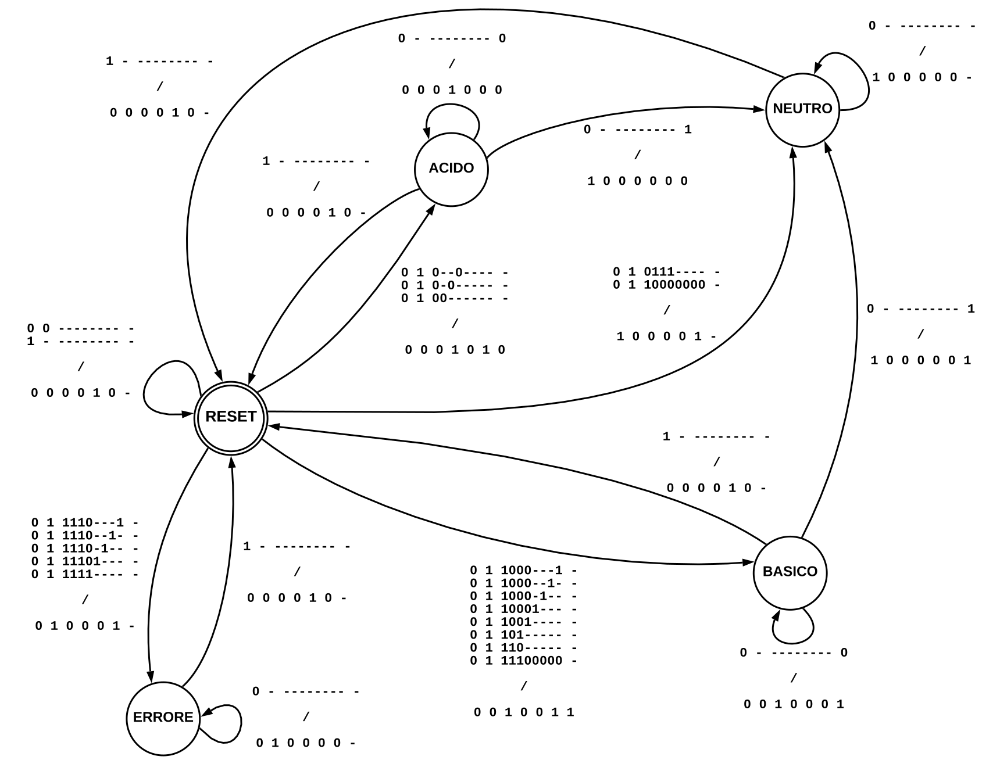
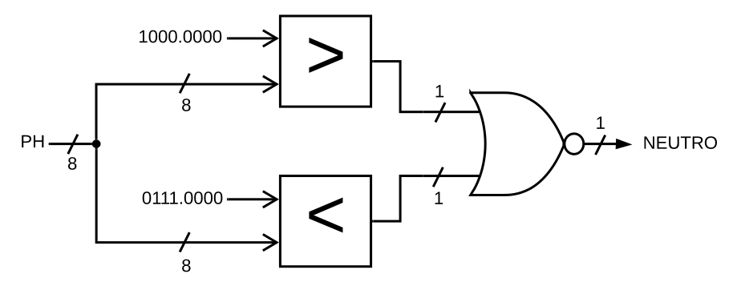

# Circuito FSM + D

Abbiamo sviluppato un circuito che controlla un meccanismo chimico, il cui scopo è portare una soluzione con un pH iniziale noto ad un valore di neutralità.

## Traccia

Il valore del pH viene espresso in valori compresi tra `0,00` e `14,0`: nell'intervallo `[0,00, 7,00)` si trovano i valori acidi, mentre in quello `(8,00, 14,0]` si trovano i valori basici, infine i valori inclusi in `[7,00, 8,00]` sono considerati neutrali. Tutti gli altri valori non sono accettabili e comportano un errore.

Il sistema è quindi dotato di due valvole: la prima può *decrementare* il valore del pH di `0.25` in un singolo ciclo di clock, mentre la seconda lo può *incrementare* di `0.50` nello stesso periodo di tempo.

{ width=65% }

### Interfaccia del circuito

Il circuito accetta i seguenti segnali di ingresso:

| **Ingresso**          | **Descrizione**                                                                         |
| --------------------: | :-------------------------------------------------------------------------------------- |
| `RST`                 | Ordina al circuito di tornare allo stato iniziale. Prevale su qualsiasi altro ingresso. |
| `START`               | Ordina al circuito di leggere il valore presente nell'ingresso `PH[8]`.                 |
| `PH_INIZIALE[8]`      | Rappresentazione del valore iniziale assunto dal pH della soluzione.                    |

L'ingresso `PH_INIZIALE[8]` è un byte codificato in **virgola fissa** con 4 bit dedicati alla parte intera.

Il circuito produce i seguenti segnali di uscita:

| **Uscita**            | **Descrizione**                                                                         |
| --------------------: | :-------------------------------------------------------------------------------------- |
| `FINE_OPER.`          | Indica che il sistema ha completato le operazioni. Ovvero il pH è neutro.               |
| `ERRORE_SENSORE`      | Indica che il sistema ha ricevuto in ingresso un valore di pH non accettabile.          |
| `VALVOLA_ACIDO`       | Richiede l'apertura della valvola che decrementa il valore del pH.                      |
| `VALVOLA_BASICO`      | Richiede l'apertura della valvola che incrementa il valore del pH.                      |
| `PH_FINALE[8]`        | Rappresentazione del valore finale assunto dal pH della soluzione.                      |
| `NCLK[8]`             | Rappresentazione del numero di cicli utilizzati per completare le operazioni.           |

L'uscita `PH_FINALE[8]` è un byte codificato esattamente come l'ingresso `PH_INIZIALE[8]`, mentre il byte `NCLK[8]` viene codificato in **modulo**.

## Architettura generale

Il sistema implementa il modello ***FSMD***, cioè collega una *macchina a stati finiti* (detta `FSM`) con un'*unità di elaborazione* (chiamata `Data path`).

Il compito della macchina a stati è quello di contestualizzare i calcoli eseguiti dall'unità di elaborazione, viceversa quest'ultima ha il ruolo di aiutare la macchina a determinare in che stato transitare.

{ width=95% }

### Segnali interni

Il collegamento tra i due sottosistemi avviene grazie allo scambio di segnali di stato e controllo; i primi vengono emessi dalla macchina a stati verso l'elaboratore, i secondi seguono il percorso inverso.

I segnali di stato utilizzati sono i seguenti:

| **Segnale**           | **Descrizione**                                                                         |
| --------------------: | :-------------------------------------------------------------------------------------- |
| `RESET`               | Ordina all'elaboratore di reinizializzare i valori.                                     |
| `INIZIO_OPER.`        | Comunica all'elaboratore che è appena stato inserito un pH.                             |
| `TIPO_PH`             | Permette all'elaboratore di determinare come modificare il pH.                          |
| `STOP_OPER.`          | Comunica all'elaboratore di non modificare i valori memorizzati.                        |

I segnali di controllo utilizzati sono i seguenti:

| **Segnale**           | **Descrizione**                                                                         |
| --------------------: | :-------------------------------------------------------------------------------------- |
| `ERRORE`              | Comunica alla macchina che il valore del pH non è accettabile.                          |
| `NEUTRO`              | Comunica alla macchina che il valore del pH ha raggiunto la neutralità.                 |

## Macchina a stati finiti (FSM)

Abbiamo individuato cinque stati per questa macchina, cioè:

1. `Reset`: stato iniziale nel quale il circuito attende il pH in ingresso;
2. `Errore`: il valore del pH appena inserito non è valido;
3. `Acido`: il valore del pH attuale è inferiore a `7,00`;
4. `Basico`: il valore del pH attuale è superiore a `8,00`;
5. `Neutro`: il valore del pH ha raggiunto un valore incluso in `[7,00, 8,00]`.

### Transizioni

Lo stato iniziale della macchina è quello di *Reset*, da questo può spostarsi solamente quando riceve il segnale `START = 1`, in quel caso:

- Quando il segnale di controllo `ERRORE` vale `1` transita nello stato di *Errore*;
- Quando il bit più significativo del segnale `PH[8]` vale `0` e non sono presenti errori, transita nello stato *Acido*;
- Quando il bit più significatico del segnale `PH[8]` vale `1` e non sono presenti errori, transita nello stato *Basico*.

La macchina si sposta nello stato *Neutro* quando il segnale di controllo `NEUTRO` vale `1`, infine, da ognuno degli stati può tornare a quello iniziale quando riceve il segnale `RST = 1`.

#### Segnali della macchina

I segnali utilizzati dalla macchina a stati sono i seguenti in ordine di presentazione:

| **Segnali** | **D'ingresso**       | **D'uscita**         |
| :---------: | :------------------- | :------------------- |
| **Esterni** | `RST`                | `FINE_OPERAZIONE`    |
|             | `START`              | `ERRORE_SENSORE`     |
|             | `PH_INIZIALE[8]`     | `VALVOLA_ACIDO`      |
|             |                      | `VALVOLA_BASICO`     |
|             |                      |                      |
| **Interni** | `ERRORE`             | `RESET`              |
|             | `NEUTRO`             | `INIZIO_OPERAZIONE`  |
|             |                      | `TIPO_PH`            |
|             |                      | `STOP_OPERAZIONE`    |

### Grafo delle transizioni (STG)

Replicando il comportamento sopra descritto, abbiamo quindi costruito il seguente grafo delle transizioni:

{ width=95% }

#### Transizione di esempio

La transizione dallo stato *Reset* verso *Basico* avviene quando:

- il segnale `RST` equivale a `0`;
- il segnale `START` equivale ad `1`;
- il bit più significativo di `PH_INIZIALE[8]` vale `1`;
- il segnale `ERRORE` equivale a `0`.

Viene ignorato il segnale `NEUTRO` perché il circuito deve prima memorizzare il valore e solo in un ciclo successivo è in grado di rilevare la sua eventuale neutralità; infatti la macchina a stati non è in grado di raggiungere lo stato *Neutro* senza prima transitare per *Acido* o *Basico*.

> Nel codice sorgente tale transizione viene descritta come:
>
> ```java
> 011-------0- Reset Basico 00100110
> ```

## Unità di elaborazione (Data path)

Abbiamo suddiviso l'unità di elaborazione in più sottoproblemi risolti da delle componenti specifiche:

1. *Contatore dei cicli*: memorizza ed incrementa il numero di cicli impiegati;
2. *Modificatore del pH*: aggiorna il valore del pH;
3. *Verificatore di neutralità*: determina se il valore del pH è interno a `[7,00, 8,00]`;
4. *Verificatore di errore*: determina se il valore del pH è superiore a `14,0`.

### Conteggio dei cicli

Il contatore è composto da: un registro, tre multiplexer ed un sommatore ad 8 bit.

{ width=79% }

> È un componente dedicato esclusivamente al calcolo dell'uscita `NCLK[8]`, mentre gli altri collaborano tra loro sia per determinare i segnali di controllo, che soprattutto per calcolare l'uscita `PH_FINALE[8]`.

Incrementa di `1` il valore memorizzato nel registro ad ogni ciclo ad eccezione dei casi in cui riceve il segnale `STOP = 1`. Invece, quando l'ingresso `RESET` equivale ad `1`, indipendentemente dal valore dell'altro, azzera il valore memorizzato nel registro.

### Modifica del pH

Il modificatore è composto da: un sommatore, un sottrattore ed un multiplexer ad 8 bit.

{ width=50% }

Modifica il valore dell'ingresso `PH[8]` in funzione del segnale `TIPO_PH`, cioé:

- nel caso in cui `TIPO_PH` equivale a `0` incrementa il pH di `0,50`;
- nel caso in cui `TIPO_PH` equivale ad `1` decrementa il pH di `0,25`.

### Verifica della neutralità

Il componente è composto da: un maggiore ed un minore ad 8 bit ed una porta NOR.

{ width=60% }

Verifica il valore dell'ingresso `PH_INIZIALE[8]`, cioè:

- se questo è incluso in `[7,00, 8,00]` allora restituisce `1`, cioè *vero*;
- altrimenti restituisce `0` cioè *falso*.

### Verifica degli errori

Il componente è composto da un maggiore ad 8 bit.

Verifica il valore dell'ingresso `PH_INIZIALE[8]`, cioè:

- se questo è superiore a `14,0`, allora restituisce `1`, cioè *vero*;
- altrimenti restituisce `0` cioè *falso*.

{ width=28% }

### Unità completa

È composta da: due registri, quattro multiplexer ad 8 bit, un modificatore, un verificatore di errore ed uno di neutralità.

> Coordina gli altri componenti tramite registri e multiplexer aggiuntivi.

#### Corpo principale

Quando sia il segnale `INIZIO_OPERAZIONE` che `RESET` valgono `0` il circuito continua ad elaborare il valore inserito precedentemente, al contrario:

- se `RESET` equivale ad `1`, indipendentemente dagli altri ingressi, il circuito restituisce un byte azzerato;
- oppure, se `INIZIO_OPERAZIONE` vale `1` restituisce il segnale `PH_INIZIALE[8]`;

Questo valore viene quindi analizzato tramite il *Verificatore di errore* per determinare se la codifica è accettabile, viene restituito se il segnale `STOP_OPERAZIONE` equivale ad `1` e viene finalmente memorizzato nel registro.

Nel ciclo di clock successivo il circuito utilizza il *Modificatore del pH* per aggiornare il valore, e ancora:

- quando il valore del segnale di stato `STOP_OPERAZIONE` equivale a `0` restituisce il valore modificato;
- altrimenti se equivale ad `1` restituisce il valore memorizzato.

Infine usufruisce del *Verificatore di neutralità* per determinare se il valore è neutro ed indirizza il nuovo risultato all'interno dei multiplexer iniziali.

Il segnale di uscita `PH_FINALE[8]` non viene restituito finché il segnale `STOP_OPERAZIONE` non quivale ad `1`: in quel caso restituisce il valore prodotto dai multiplexer iniziali.

#### Contatore

Il circuito utilizza il *Contatore dei cicli* per riuscire a determinare quante operazioni ha impiegato per raggiungere il risultato. Il segnale di uscita `NCLK[8]` non viene restituito finché il segnale `STOP_OPERAZIONE` non diviene uguale ad `1`.

#### Segnali dell'unità

I segnali utilizzati dall'unità a stati sono i seguenti in ordine di presentazione:

| **Segnali** | **D'ingresso**       | **D'uscita**         |
| :---------: | :------------------- | :------------------- |
| **Esterni** | `PH_INIZIALE[8]`     | `PH_FINALE[8]`       |
|             |                      | `NCLK[8]`            |
|             |                      |                      |
| **Interni** | `RESET`              | `ERRORE`             |
|             | `INIZIO_OPERAZIONE`  | `NEUTRO`             |
|             | `TIPO_PH`            |                      |
|             | `STOP_OPERAZIONE`    |                      |

{ width=95% }

Il registro ad 1 bit che memorizza il segnale `TIPO_PH` è presente per evitare di creare un ciclo all'interno del circuito e renderlo non deterministico.

Sostituendo il contenuto dei componenti all'interno del corpo principale otteniamo il seguente circuito:

{ width=100% }

Il *Contatore dei cicli* invece è un componente autonomo e abbiamo scelto di non includerlo in questa immagine per problemi di spazio, è comunque presente all'interno del circuito.

## Simulazioni di esempio

Dopo aver progettato i due sottosistemi abbiamo provato alcuni flussi di esecuzione: il primo vede come ingresso un pH pari a `5,75` che quindi impiega 4 cicli per completare l'operazione con un pH finale di `5,75`; nel secondo invece abbiamo tentato di inserire un pH non valido e dopo aver segnalato l'errore non ha elaborato oltre.

### Esempio 1

```sh
# Inserendo RST = 0, START = 1, PH = 5,75.
sis> simulate 0 1 0 1 0 1 1 1 0 0 

# Otteniamo VALVOLA_BASICO = 1.
Network simulation:
Outputs: 0 0 0 1 0 0 0 0 0 0 0 0 0 0 0 0 0 0 0 0
Next state: 00101110000000001010

# Inserendo tutti i valori a 0.
sis> simulate 0 0 0 0 0 0 0 0 0 0

# Prosegue con l'elaborazione.
Network simulation:
Outputs: 0 0 0 1 0 0 0 0 0 0 0 0 0 0 0 0 0 0 0 0
Next state: 00110010000000010010

# Inserendo tutti i valori a 0.
sis> simulate 0 0 0 0 0 0 0 0 0 0

# Prosegue con l'elaborazione.
Network simulation:
Outputs: 0 0 0 1 0 0 0 0 0 0 0 0 0 0 0 0 0 0 0 0
Next state: 00110110000000011010

# Inserendo tutti i valori a 0.
sis> simulate 0 0 0 0 0 0 0 0 0 0

# Prosegue con l'elaborazione.
Network simulation:
Outputs: 0 0 0 1 0 0 0 0 0 0 0 0 0 0 0 0 0 0 0 0
Next state: 00111010000000100010

# Inserendo tutti i valori a 0.
sis> simulate 0 0 0 0 0 0 0 0 0 0

# Otteniamo FINE_OPERAZIONE = 1, PH = 7,25, NCLK = 4.
Network simulation:
Outputs: 1 0 0 0 0 1 1 1 0 1 0 0 0 0 0 0 0 1 0 0
Next state: 00111010000000100001
```

### Esempio 2

```sh
# Inserendo RST = 0, START = 1, PH = 14.0625.
sis> sim 0 1 1 1 1 0 0 0 0 1

# Otteniamo ERRORE_SENSORE = 1.
Network simulation:
Outputs: 0 1 0 0 0 0 0 0 0 0 0 0 0 0 0 0 0 0 0 0
Next state: 01110000100000001110

# Inserendo tutti i valori a 0.
sis> sim 0 0 0 0 0 0 0 0 0 0 

# Otteniamo ERRORE_SENSORE = 1, PH = 14.0625.
Network simulation:
Outputs: 0 1 0 0 1 1 1 0 0 0 0 1 0 0 0 0 0 0 0 1
Next state: 11110000100000001110
```

<!--
## Statistiche

### Prima dell'ottimizzazione

Le statistiche del circuito prima dell'ottimizzazione per area sono:

```js
FSM             pi=12   po= 8   nodes= 11       latches= 3
lits(sop)= 144  #states(STG)=   5
```

```js
DATAPATH        pi=12   po=18   nodes=165       latches=17
lits(sop)= 881
```

```js
FSMD            pi=10   po=20   nodes=174       latches=17
lits(sop)= 881
```

Dove:

- `pi` è il numero degli input.
- `po` è il numero degli output.
- `nodes` è il numero di nodi.
- `latches` è il numero di registri.
- `lits(sop)` è il numero dei letterali.

### Dopo l'ottimizzazione

Per covertire la FSM in un circuito abbiamo utilizzato i seguenti comandi:

```sh
state_minimize stamina
state_assign jedi

stg_to_network
```

> Il numero degli stati è rimasto identico nonostante l'esecuzione del comando `state_minimize stamina`.

Dopo aver convertito la FSM, abbiamo ottimizzato tutte le parti del circuito ripetendo il comando `source script.rugged` finché non ha raggiunto il miglior risultato possibile, infine abbiamo eseguito l'istruzione `fx` per ridurre ulteriormente il numero dei letterali.

Le statistiche del circuito dopo l'ottimizzazione per area sono:

```js
FSM             pi=12   po= 8   nodes= 10       latches= 3
lits(sop)=  47  #states(STG)=   5
```

```js
DATAPATH        pi=12   po=18   nodes= 49       latches=17
lits(sop)= 244
```

```js
FSMD            pi=10   po=20   nodes= 55       latches=20
lits(sop)= 295
```

## Mappatura tecnologica

Dopo l'otimizzazione del circuito si deve eseguire la mappatura tecnologica che consiste nell'associare a ogni componente la sua rappresentazione reale.

Il circuito mappato ha le seguenti statistiche:

```sh
>>> before removing serial inverters <<<
# of outputs:          40
total gate area:       6480.00
maximum arrival time: (37.00,37.00)
maximum po slack:     (-11.40,-11.40)
minimum po slack:     (-37.00,-37.00)
total neg slack:      (-986.20,-986.20)
# of failing outputs:  40
>>> before removing parallel inverters <<<
# of outputs:          40
total gate area:       6384.00
maximum arrival time: (35.80,35.80)
maximum po slack:     (-11.40,-11.40)
minimum po slack:     (-35.80,-35.80)
total neg slack:      (-971.80,-971.80)
# of failing outputs:  40
# of outputs:          40
total gate area:       5968.00
maximum arrival time: (35.60,35.60)
maximum po slack:     (-11.40,-11.40)
minimum po slack:     (-35.60,-35.60)
total neg slack:      (-957.60,-957.60)
# of failing outputs:  40
```

Il **total gate area (area)** è `5968.00` mentre l'**arrival time (cammino critico)** è `35.60`.

## La descrizione delle scelte progettuali

Durante l'implementazione del progetto abbiamo fatto le seguenti scelte progettuali:

1. Per controllare se il pH è acido oppure basico sfruttiamo il bit più significativo, se esso è a 0 allora è acido se è a 1 allora è basico. Questo comprenderebbe che anche i valori neutri vengono assegnati a uno dei due tipi, per risolvere il problema abbiamo messo un controllore di neutralità nel DATA-PATH in modo tale che il esso comunichi alla FSM di cambiare stato da ***Acido*** o ***Basico*** a ***Neutro***.

1. Per controllare l'errore abbiamo aggiunto un componente al DATA-PATH che restituisce uno se e solo se è presente un errore (pH > 14) in questo modo la FSM cambia stato da ***Reset*** a ***Errore***.

1. Per semplificare la scrittura e la lettura dei componenti in formato `blif` abbiamo suddiviso il DATA-PATH in più pezzi (`error.blif`, `modifier.blif`, `neutral.blif`, `counter.blif`) che poi abbiamo utilizzato tramite i `subckt` e i `search`.

1. Abbiamo aggiunto un registro per `TIPO_PH` essendo che senza di esso si andrebbe a creare un **network cycle**.

-->
