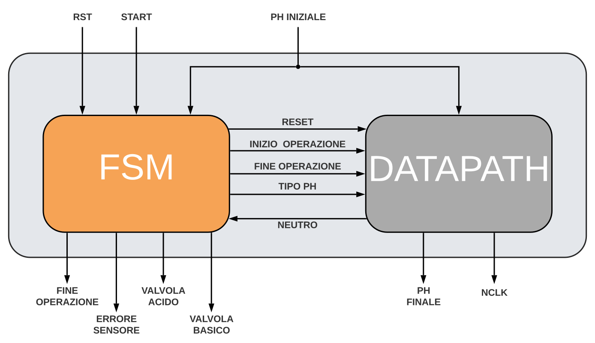
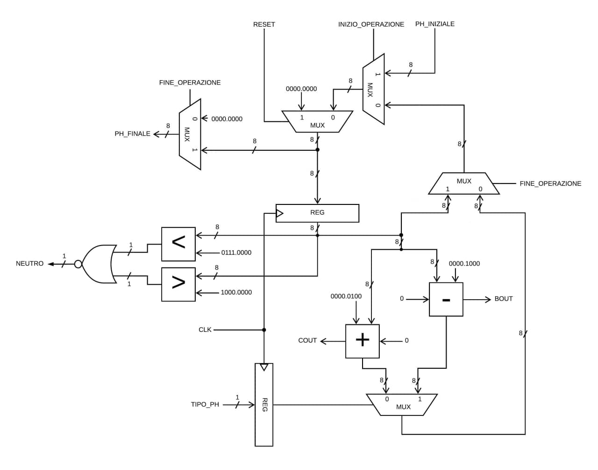

# Circuito FSM + D

Abbiamo sviluppato un circuito che controlla un meccanismo chimico, il cui scopo è portare una soluzione con un pH iniziale noto ad un valore di neutralità.

## Traccia

Il valore del pH viene espresso in valori compresi tra `0,00` e `14,0`: nell'intervallo `[0,00, 7,00)` si trovano i valori acidi, mentre in quello `(8,00, 14,0]` si trovano i valori basici, infine i valori inclusi in `[7,00, 8,00]` sono considerati neutrali. Tutti gli altri valori non sono accettabili e comportano un errore.

Il sistema è quindi dotato di due valvole: la prima può *decrementare* il valore del pH di `0.50` in un singolo ciclo di clock, mentre la seconda lo può *incrementare* di `0.25` nello stesso periodo di tempo.

{ width=65% }

### Interfaccia del circuito

Il circuito accetta i seguenti segnali di ingresso:

| **Nome**                | **Descrizione**                                                 |
| ----------------------: | :-------------------------------------------------------------- |
| `RST`                   | Ordina al circuito di tornare allo stato iniziale.              |
| `START`                 | Ordina al circuito di leggere il segnale `PH_INIZIALE[8]`.      |
| `PH_INIZIALE[8]`        | Rappresenta il valore iniziale del pH.                          |

L'ingresso `PH_INIZIALE[8]` è un byte codificato in **virgola fissa** con 4 bit dedicati alla parte intera.

Il circuito produce i seguenti segnali di uscita:

| **Nome**                | **Descrizione**                                                 |
| ----------------------: | :-------------------------------------------------------------- |
| `FINE_OPERAZIONE`       | Indica che il sistema ha completato i calcoli.                  |
| `ERRORE_SENSORE`        | Indica che il sistema ha ricevuto un pH invalido.               |
| `VALVOLA_ACIDO`         | Richiede il decremento del pH.                                  |
| `VALVOLA_BASICO`        | Richiede l'incremento del pH.                                   |
| `PH_FINALE[8]`          | Rappresenta il valore finale del pH.                            |
| `NCLK[8]`               | Rappresenta il numero di cicli impiegati.                       |

L'uscita `PH_FINALE[8]` è un byte codificato esattamente come l'ingresso `PH_INIZIALE[8]`, mentre il byte `NCLK[8]` viene codificato in **modulo**.

## Architettura generale

Il sistema implementa il modello ***FSMD***, cioè collega una *macchina a stati finiti* (detta `FSM`) con un'*unità di elaborazione* (chiamata `Data path`).

Il compito della macchina a stati è quello di contestualizzare i calcoli eseguiti dall'unità di elaborazione, viceversa quest'ultima ha il ruolo di aiutare la macchina a determinare in che stato transitare.

{ width=90% }

### Segnali interni

Il collegamento tra i due sottosistemi avviene grazie allo scambio di segnali di stato e controllo; i primi vengono emessi dalla macchina a stati verso l'elaboratore, i secondi seguono il percorso inverso.

I segnali di stato utilizzati sono i seguenti:

| **Nome**                | **Descrizione**                                                 |
| ----------------------: | :-------------------------------------------------------------- |
| `RESET`                 | Ordina all'elaboratore di inizializzare i valori.               |
| `INIZIO_OPER.`          | Comunica all'elaboratore che è iniziata un'operazione.          |
| `FINE_OPER.`            | Comunica all'elaboratore che è finita l'operazione.             |
| `TIPO_PH`               | Permette all'elaboratore di modificare il pH correttamente.     |

I segnali di controllo utilizzati sono i seguenti:

| **Nome**                | **Descrizione**                                                 |
| ----------------------: | :-------------------------------------------------------------- |
| `NEUTRO`                | Comunica alla macchina che il pH ha raggiunto la neutralità.    |

## Macchina a stati finiti (FSM)

Abbiamo individuato cinque stati per questa macchina, cioè:

1. `Reset`: stato iniziale nel quale il circuito attende il pH in ingresso;
2. `Errore`: il valore del pH appena inserito non è valido;
3. `Acido`: il valore del pH attuale è inferiore a `7,00`;
4. `Basico`: il valore del pH attuale è superiore a `8,00`;
5. `Neutro`: il valore del pH ha raggiunto un valore incluso in `[7,00, 8,00]`.

### Transizioni

Lo stato iniziale della macchina è quello di *Reset*, da questo può spostarsi solamente quando riceve il segnale `START = 1`, in quel caso:

- quando il pH è superiore a `14,0` transita nello stato di *Errore*;
- quando il pH è minore stretto di `7,00` transita nello stato di *Acido*;
- quando il pH è maggiore stretto di `8,00` transita nello stato di *Basico*;
- quando il pH è già compreso nell'intervallo `[7,00, 8,00]` transita nello stato di *Neutro*.

Da ognuno degli stati può tornare a quello iniziale solo quando riceve il segnale `RST = 1`, altrimenti si sposta da *Acido* e *Basico* verso *Neutro* quando il segnale di controllo `NEUTRO = 1`.

> Il segnale `RST` ha la precendeza su `START`, in altre parole: quando entrambi equivalgono ad `1`, il secondo viene semplicemente ignorato.

### Grafo delle transizioni (STG)

Implementando il comportamento sopra descritto, abbiamo costruito il grafo delle transizioni utilizzando i seguenti segnali:

| **Segnali** | **D'ingresso**       | **D'uscita**         |
| :---------: | :------------------- | :------------------- |
| **Esterni** | `RST`                | `FINE_OPER.`         |
|             | `START`              | `ERRORE_SENSORE`     |
|             | `PH_INIZIALE[8]`     | `VALVOLA_ACIDO`      |
|             |                      | `VALVOLA_BASICO`     |
| **Interni** | `NEUTRO`             | `RESET`              |
|             |                      | `INIZIO_OPER.`       |
|             |                      | `TIPO_PH`            |

{ width=100% }

#### Transizione di esempio

La transizione dallo stato *Reset* verso *Acido* avviene quando riceve:

- i segnali `RST = 0` e `START = 1`;
- i segnale `PH_INIZIALE[8]` interno a `[0, 7)`.

Il segnale `NEUTRO` viene ignorato perché l'unità di elaborazione non ha ancora memorizzato il pH: viene memorizzato solamente dopo la prima transizione verso uno stato diverso da *Reset*.

Nel codice sorgente tale transizione viene descritta come:

> ```java
> 010--0----- Reset Acido 0001010
> 010-0------ Reset Acido 0001010
> 0100------- Reset Acido 0001010
> ```

## Unità di elaborazione (Data path)

Abbiamo suddiviso l'unità di elaborazione in più sottoproblemi risolti da delle parti specifiche:

1. *Contatore dei cicli*: memorizza ed incrementa il numero di cicli impiegati;
2. *Corpo principale*: si occupa della modifica del pH.

<!-- 2. *Modificatore del pH*: aggiorna il valore del pH;
3. *Verificatore di neutralità*: determina se il valore del pH è interno a `[7,00, 8,00]`; -->

### Contatore dei cicli

Il contatore è composto da: un registro, tre multiplexer ed un sommatore ad 8 bit.

{ width=90% }

È il componente dedicato esclusivamente al calcolo dell'uscita `NCLK[8]`.

Ad ogni ciclo incrementa il valore memorizzato di un'unità. Quando riceve i segnali `RESET = 1` o `INIZIO_OPERAZIONE = 1` azzera il conteggio, mentre quando il segnale `FINE_OPERAZIONE = 1` non incrementa il valore e lo mostra in uscita.

### Corpo principale

Il corpo principale è composto da: quattro multiplexer e due registri ad 8 bit.

{ width=100% }

Quando il segnale `RESET = 1` il circuito inizializza il registro, invece quando equivale a `0` e `INIZIO_OPERAZIONE = 1` l'elaboratore legge `PH_INIZIALE[8]`.

> Il segnale `RESET` ha la precendeza su `INIZIO_OPERAZIONE`, in altre parole: quando entrambi equivalgono ad `1`, il secondo viene semplicemente ignorato.

Il byte che giunge dai multiplexer viene memorizzato nel registro. Nel ciclo di clock successivo viene fornito il valore al *Verificatore di neutralità* ed al *Modificatore del pH*, infine:

- se il valore del segnale `FINE_OPERAZIONE` equivale a `0` memorizza il valore modificato;
- altrimenti lo lascia intatto e mostra l'uscita `PH_FINALE[8]`.

#### Modifica del pH

Il modificatore è composto da: un sommatore, un sottrattore ed un multiplexer ad 8 bit.

{ width=50% }

Modifica il valore dell'ingresso `PH[8]` in funzione del segnale `TIPO_PH`, cioé:

- quando `TIPO_PH` equivale a `0` incrementa il pH di `0,25`;
- quando `TIPO_PH` equivale ad `1` decrementa il pH di `0,50`.

#### Verifica della neutralità

Il componente è composto da: un maggiore ed un minore ad 8 bit ed una porta NOR.

{ width=60% }

Verifica il valore dell'ingresso `PH_INIZIALE[8]`, cioè:

- se questo è incluso in `[7,00, 8,00]` allora restituisce `1`, cioè *vero*;
- altrimenti restituisce `0` cioè *falso*.

## Simulazioni di esempio

Ecco due esempi di esecuzione del circuito.

### Esempio 1

Inserendo un pH pari a `9,25` e specificando il segnale `START = 1` otteniamo come risultato semplicemente `VALVOLA_ACIDO = 1`.

> ```java
> sis> simulate 0 1 1 0 0 1 0 1 0 0
> 
> Network simulation:
> Outputs: 0 0 1 0 0 0 0 0 0 0 0 0 0 0 0 0 0 0 0 0
> ```

Non fornendo altri spunti al sistema per tre volte otteniamo sempre `VALVOLA_ACIDO = 1`, infatti:

$$
\begin{aligned}
    9,25 - 0,&50 = 8,75 \\
    8,75 - 0,&50 = 8,25 \\
    8,25 - 0,&50 = 7,75 \\
\end{aligned}
$$

> ```java
> sis> simulate 0 0 0 0 0 0 0 0 0 0
> 
> Network simulation:
> Outputs: 0 0 1 0 0 0 0 0 0 0 0 0 0 0 0 0 0 0 0 0
> ```

Infine dopo aver raggiunto un pH neutro, otteniamo `FINE_OPERAZIONE = 1`, un pH finale pari a `7,75` ed esattamente tre cicli impiegati per completare il calcolo.

> ```java
> sis> simulate 0 0 0 0 0 0 0 0 0 0
> 
> Network simulation:
> Outputs: 1 0 0 0 0 1 1 1 1 1 0 0 0 0 0 0 0 0 1 1
> ```

### Esempio 2

Inserendo un pH pari a `15,9375` e specificando il segnale `START = 1` otteniamo come risultato giustamente `ERRORE_SENSORE = 1`.

> ```java
> sis> simulate 0 1 1 1 1 1 1 1 1 1
> 
> Network simulation:
> Outputs: 0 1 0 0 0 0 0 0 0 0 0 0 0 0 0 0 0 0 0 0
> ```

Non fornendo altri spunti al sistema otteniamo sempre `ERRORE_SENSORE = 1`.

> ```java
> sis> simulate 0 0 0 0 0 0 0 0 0 0
> 
> Network simulation:
> Outputs: 0 1 0 0 0 0 0 0 0 0 0 0 0 0 0 0 0 0 0 0
> ```

## Statistiche

Prima dell'ottimizzazione, la macchina a stati presenta: `10` nodi, `593` letterali e `5` stati come si può vedere dal comando sottostante.

> ```java
> sis> print_stats
> 
> FSM             pi=11   po= 7   nodes= 10       latches= 3
> lits(sop)= 593  #states(STG)=   5
> ```

Al contrario l'unità di elaborazione presenta `163` nodi e `755` letterali.

> ```java
> sis> print_stats
> 
> DATAPATH        pi=12   po=17   nodes=163       latches=17
> lits(sop)= 755
> ```

Infine unendo i due sottosistemi in un unico circuito otteniamo `173` nodi e `1348` letterali, ovvero la somma dei due.

> ```java
> sis> print_stats
> 
> FSMD            pi=10   po=20   nodes=173       latches=20
> lits(sop)=1348
> ```

In risposta si ottiene anche il numero di input ed output: rispettivamente `pi` e `po` e anche il numero di registri presenti, ovvero `latches`.

### Ottimizzazione

Per covertire la macchina a stati in un circuito abbiamo utilizzato i seguenti comandi:

> ```java
> sis> state_minimize stamina
> sis> state_assign   jedi
> ```

Il numero degli stati è rimasto identico anche dopo il comando `state_minimize stamina`.

Abbiamo quindi ottimizzato la macchina a stati tramite i comandi:

> ```java
> sis> full_simplify
> sis> source script.rugged
> sis> fx
> ```

Al contrario, per l'unità di elaborazione:

> ```java
> sis> eliminate -1
> sis> full_simplify
> sis> source script.rugged
> sis> source script.rugged
> sis> fx
> ```

Infine, per il circuito completo:

> ```java
> sis> source script.rugged
> sis> fx
> ```

#### Risultati

Dopo l'ottimizzazione, la macchina a stati presenta: `13` nodi, `54` letterali e `5` stati.

> ```java
> sis> print_stats
> 
> FSM             pi=11   po= 7   nodes= 13       latches= 3
> lits(sop)=  54  #states(STG)=   5
> ```

Al contrario l'unità di elaborazione presenta `48` nodi e `220` letterali.

> ```java
> sis> print_stats
> 
> DATAPATH        pi=12   po=17   nodes= 48       latches=17
> lits(sop)= 220
> ```

Infine unendo i due sottosistemi già ottimizzati in un unico circuito e lo ottimizziamo nuovamente otteniamo `62` nodi e `272` letterali.

> ```java
> sis> print_stats
> 
> FSMD            pi=10   po=20   nodes= 62       latches=20
> lits(sop)= 272
> ```

## Mappatura tecnologica

Dopo l'ottimizzazione abbiamo eseguito la mappatura tecnologica che consiste nell'associare ad ogni componente la sua rappresentazione reale.

Abbiamo mappato il circuito utilizzando la libreria `synch.genlib` ed il comando `map -m 0` che cerca di ridurre al minimo l'area occupata a discapito del ritardo.

Eseguendo il comando `print_map_stats`, possiamo notare che l'area totale occupata dal circuito è pari a `6024,00` celle standard della libreria ed il cammino critico, cioè il numero massimo di nodi che deve percorrere per raggiungere l'uscita, è pari a `40`, infatti:

> ```java
> sis> print_map_stats
> 
> Total Area              = 6024.00
> Gate Count              = 169
> Buffer Count            = 20
> Inverter Count          = 39
> Most Negative Slack     = -35.60
> Sum of Negative Slacks  = -1005.60
> Number of Critical PO   = 40
> ```

Il comando `map -s` mostra le seguenti statistiche:

> ```java
> sis> map -s
> 
> >>> before removing serial inverters <<<
> # of outputs:          40
> total gate area:       6360.00
> maximum arrival time: (38.60,38.60)
> maximum po slack:     (-10.00,-10.00)
> minimum po slack:     (-38.60,-38.60)
> total neg slack:      (-1053.40,-1053.40)
> # of failing outputs:  40
> >>> before removing parallel inverters <<<
> # of outputs:          40
> total gate area:       6216.00
> maximum arrival time: (36.20,36.20)
> maximum po slack:     (-7.80,-7.80)
> minimum po slack:     (-36.20,-36.20)
> total neg slack:      (-1026.80,-1026.80)
> # of failing outputs:  40
> # of outputs:          40
> total gate area:       6024.00
> maximum arrival time: (35.60,35.60)
> maximum po slack:     (-7.60,-7.60)
> minimum po slack:     (-35.60,-35.60)
> total neg slack:      (-1005.60,-1005.60)
> # of failing outputs:  40
> ```

Abbiamo verificato il ritardo segnalato dalla libreria come `maximum arrival time` che è pari a `35,60`.

## Scelte progettuali

Durante la progettazione abbiamo preso le seguenti scelte progettuali:

<!-- Dopo l'inserimento del pH la macchina a stati decide in tutta autonomia in che stato transitare in base alla codifica: questo perché in ingresso -->

1. Durante l'inserimento può essere presente un pH inaccettabile o già neutro e l'elaboratore lo memorizza solo il ciclo dopo. Perciò è la macchina a stati a decidere in totale autonomia in quale stato transitare in base al valore.

2. Dopo che la macchina ha raggiunto gli stati *Acido* e *Basico* utilizza un bit di cotrollo chiamato `NEUTRO` per decidere se raggiungere lo stato *Neutro*.

3. Per semplificare l'implementazione dell'unità di elaborazione, abbiamo suddiviso il codice sorgente in più modelli distinti in base al problema che risolvono: ad esempio il file "*counter.blif*" si occupa esclusivamente dell'uscita `NCLK[8]` e viene poi utilizzato dentro il file "*DATA-PATH.blif*".

4. Abbiamo usufruito di un registro ad un bit in più nell'elaboratore per evitare di causare un ciclo all'interno del circuito.
