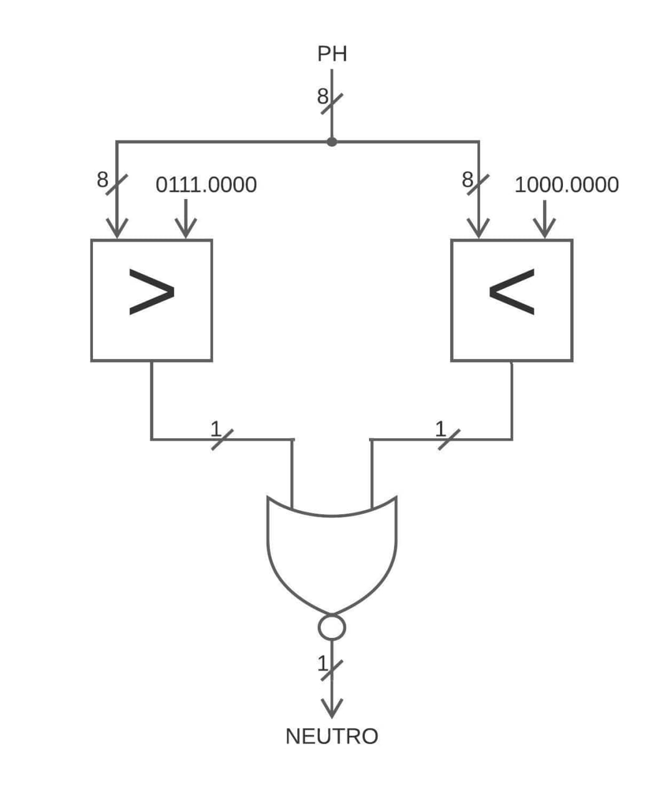

# Circuito FSM + D

Abbiamo sviluppato un circuito che controlla un meccanismo chimico, il cui scopo è portare una soluzione con un pH iniziale noto ad un valore di neutralità.

## Traccia

Il valore del pH viene espresso in valori compresi tra `0.00` e `14.0`: nell'intervallo `[0.00, 7.00)` si trovano i valori acidi, mentre in quello `(8.00, 14.0]` si trovano i valori basici, infine i valori compresi in `[7.00, 8.00]` sono considerati neutrali. Tutti gli altri valori non sono accettabili e comportano un errore.

Il sistema è quindi dotato di due valvole: la prima può *decrementare* il valore del pH di `0.25` in un singolo ciclo di clock, mentre la seconda lo può *incrementare* di `0.50` nello stesso periodo di tempo.

{ width=65% }

### Interfaccia del circuito

Il circuito accetta i seguenti segnali di ingresso:

| **Ingresso**          | **Descrizione**                                                                         |
| --------------------: | :-------------------------------------------------------------------------------------- |
| `RST`                 | Ordina al circuito di tornare allo stato iniziale. Prevale su qualsiasi altro ingresso. |
| `START`               | Ordina al circuito di leggere il valore presente nell'ingresso `PH[8]`.                 |
| `PH[8]`               | Rappresentazione del valore iniziale assunto dal pH della soluzione.                    |

L'ingresso `PH[8]` è un byte codificato in **virgola fissa** con 4 bit dedicati alla parte intera.

Il circuito produce i seguenti segnali di uscita:

| **Uscita**            | **Descrizione**                                                                         |
| --------------------: | :-------------------------------------------------------------------------------------- |
| `FINE_OPER.`          | Indica che il sistema ha completato le operazioni. Ovvero il pH è neutro.               |
| `ERRORE_SENSORE`      | Indica che il sistema ha ricevuto in ingresso un valore di pH non accettabile.          |
| `VALVOLA_ACIDO`       | Richiede l'apertura della valvola che decrementa il valore del pH.                      |
| `VALVOLA_BASICO`      | Richiede l'apertura della valvola che incrementa il valore del pH.                      |
| `PH_FINALE[8]`        | Rappresentazione del valore finale assunto dal pH della soluzione.                      |
| `NCLK[8]`             | Rappresentazione del numero di cicli utilizzati per completare le operazioni.           |

L'uscita `PH_FINALE[8]` è un byte codificato esattamente come l'ingresso `PH[8]`, mentre il byte `NCLK[8]` viene codificato in **modulo**.

## Architettura generale

Il sistema implementa il modello ***FSMD***, cioè collega una *macchina a stati finiti* (detta `FSM`) con un'*unità di elaborazione* (chiamata `Data path`).

Il compito della macchina a stati è quello di contestualizzare i calcoli eseguiti dall'elaboratore, viceversa quest'ultimo ha il ruolo di aiutare la macchina a determinare in che stato transitare.

<!-- Immagine da sistmare i collegamenti tra FSM e DATA-PATH -->

### Segnali interni

Il collegamento tra i due sottosistemi avviene grazie allo scambio di segnali di stato e controllo; i primi vengono emessi dalla macchina a stati verso l'elaboratore, i secondi seguono il percorso inverso.

I segnali di stato utilizzati sono i seguenti:

| **Segnale**           | **Descrizione**                                                                         |
| --------------------: | :-------------------------------------------------------------------------------------- |
| `RESET`               | Ordina all'elaboratore di reinizializzare i valori.                                     |
| `INIZIO_OPER.`        | Comunica all'elaboratore che è appena stato inserito un pH.                             |
| `TIPO_PH`             | Permette all'elaboratore di determinare come modificare il pH.                          |
| `STOP_OPER.`          | Comunica all'elaboratore di non modificare i valori memorizzati.                        |

I segnali di controllo utilizzati sono i seguenti:

| **Segnale**           | **Descrizione**                                                                         |
| --------------------: | :-------------------------------------------------------------------------------------- |
| `ERRORE`              | Comunica alla macchina che il valore del pH non è accettabile.                          |
| `NEUTRO`              | Comunica alla macchina che il valore del pH ha raggiunto la neutralità.                 |

## Macchina a stati finiti (FSM)

Abbiamo individuato cinque stati per la macchina, cioè:

1. `Reset`: stato iniziale, in cui l'elaboratore viene inizializzato;
2. `Errore`: il valore del pH appena inserito non è valido;
3. `Acido`: il valore del pH è inferiore a `7.00`;
4. `Basico`: il valore del pH è superiore a `8.00`;
5. `Neutro`: il valore del pH ha raggiunto un valore compreso in `[7.00, 8.00]`.

### Transizioni

I segnali utilizzati per le transizioni della macchina sono:

| **Ingressi**       | **Uscite**          |
| -----------------: | :------------------ |
| `RST`              | `FINE_OPERAZIONE`   |
| `START`            | `ERRORE_SENSORE`    |
| `PH[8]`            | `VALVOLA_ACIDO`     |
| `ERRORE`           | `VALVOLA_BASICO`    |
| `NEUTRO`           | `RESET`             |
|                    | `INIZIO_OPERAZIONE` |
|                    | `TIPO_PH`           |
|                    | `STOP_OPERAZIONE`   |

### Grafo delle transizioni

Di seguito un l'immagine del grafo delle transizioni.


<!-- SPIEGAZIONE TRANSIZIONI -->

### Tabella delle transizioni

Di seguito il codice sorgente della tabella delle transizioni descritta nel formato utilizzato da **SIS**.

```sh
# Transizioni da Reset
1----------- Reset  Reset   000010-0
00---------- Reset  Reset   000010-0
01--------1- Reset  Errore  010001-0
010-------0- Reset  Acido   00010100
011-------0- Reset  Basico  00100110

# Transizione da Errore
0----------- Errore Errore  010000-1
1----------- Errore Reset   000010-0

# Transizioni da Acido
0----------0 Acido  Acido   00010000
0----------1 Acido  Neutro  10000001
1----------- Acido  Reset   000010-0

# Transizioni da Basico
0----------0 Basico Basico  00100010
0----------1 Basico Neutro  10000011
1----------- Basico Reset   000010-0

# Transizioni da Neutro
0----------- Neutro Neutro  100000-1
1----------- Neutro Reset   000010-0
```

## Unità di elaborazione

L'unità di elaborazione è suddivisa in più componenti:

1. *Contatore*: memorizza e incrementa il numero di cicli impiegati;
2. *Modificatore*: applica le modifiche al pH;
3. *Errore*: verifica se il valore del pH è superiore a `14`;
4. *Neutrale*: verifica se il valore del pH è compreso in `[7.00, 8.00]`.

### Contatore

Il contatore utilizza un registro, tre multiplexer ed un sommatore, tutti ad 8 bit.

Il componente incrementa di `1` il valore memorizzato finché non riceve il segnale di `RESET = 1`. Quando riceve il segnale di `STOP = 1` non incrementa e restituisce il valore memorizzato.

### Modificatore

Il modificatore utilizza un sommatore, un sottrattore ed un multiplexer, tutti ad 8 bit.

Se il `TIPO_PH` in ingresso equivale a `0`, incrementa il valore del pH di `0.50`, al contrario, se equivale ad `1`, lo decrementa di `0.25`.


### Errore

Il componente utilizza un maggiore ad 8 bit.

Confronta il valore del pH, se questo supera il `14`, allora restituisce `1`, cioè *vero*, altrimenti `0` cioè *falso*.


### Neutrale

Il componente utilizza un maggiore ed un minore ad 8 bit ed una porta NOR.

Confronta il valore del pH, se questo è compreso in `[7.00, 8.00]` allora restituisce `1`, cioè *vero*, altrimenti `0` cioè *falso*.



### Corpo completo

È il vero e proprio elaboratore che permette di collegare gli altri componenti con l'aggiunta di `2` registri ad 8 bit e `4` multiplexer a 2 ingressi a 8 bit.

Il circuito prende in input il valore del pH solo quando riceve la combinazione `INIZIO_OPERAZIONE = 1` e `RESET = 0`, mentre se abbiamo `INIZIO_OPERAZIONE = 0` e `RESET = 0` prende il valore risultante dal multiplexer che seleziona fra il valore del registro e il risultato del *Modifier*, se invece abbiamo `RESET = 1` il circuito si resetta.

Dopo aver preso il valore in input e averlo salvato in un registro, il circuito lo passa al *Modifier* che in base al `TIPO_PH` sceglie se prendere il risultato della somma con `TIPO_PH = 0`, cioè *acido* oppure quello della sottrazione `TIPO_PH = 1`,cioè *basico*.

Il risultato viene filtrato da un multiplexer che in base a `STOP_OPERAZIONE` sceglie se tenere il valore del registo oppure aggiornarlo. L'uscita del multiplexer si dirama per andare da Neutral che effettua il controllo e restituisce `CONTROLLO_NEUTRO` mentre l'altra diramazione entra nel multiplexer di `INIZIO_OPERAZIONE`.

L'uscita del circuito è collocata tra l'uscita del multiplexer del reset e l'ingresso del registro, essa è filtrata da un multiplexer che in base al valore di `STOP_OPERAZIONE` se vale `0` l'uscita è `0`, invece se vale `1` l'uscita è quella del multiplexer del reset.

<!-- IMMMAGINE DATAPATH COMPLETO CON COMPONENTI -->
<!-- IMMMAGINE DATAPATH COMPLETO -->

## Alcune simulazioni

<!-- SIMULAZIONI -->

## Statistiche

### Prima dell'ottimizzazione

Le statistiche del circuito prima dell'ottimizzazione per area sono:

```js
FSM             pi=12   po= 8   nodes= 11       latches= 3
lits(sop)= 144  #states(STG)=   5
```

```js
DATAPATH        pi=12   po=18   nodes=165       latches=17
lits(sop)= 881
```

```js
FSMD            pi=10   po=20   nodes=174       latches=17
lits(sop)= 881
```

Dove:

- `pi` è il numero degli input.
- `po` è il numero degli output.
- `nodes` è il numero di nodi.
- `latches` è il numero di registri.
- `lits(sop)` è il numero dei letterali.

### Dopo l'ottimizzazione

Per covertire la FSM in un circuito abbiamo utilizzato i seguenti comandi:

```sh
state_minimize stamina
state_assign jedi

stg_to_network
```

> Il numero degli stati è rimasto identico nonostante l'esecuzione del comando `state_minimize stamina`.

Dopo aver convertito la FSM, abbiamo ottimizzato tutte le parti del circuito ripetendo il comando `source script.rugged` finché non ha raggiunto il miglior risultato possibile, infine abbiamo eseguito l'istruzione `fx` per ridurre ulteriormente il numero dei letterali.

Le statistiche del circuito dopo l'ottimizzazione per area sono:

```js
FSM             pi=12   po= 8   nodes= 10       latches= 3
lits(sop)=  47  #states(STG)=   5
```

```js
DATAPATH        pi=12   po=18   nodes= 49       latches=17
lits(sop)= 244
```

```js
FSMD            pi=10   po=20   nodes= 55       latches=20
lits(sop)= 295
```

## Mappatura tecnologica

Dopo l'otimizzazione del circuito si deve eseguire la mappatura tecnologica che consiste nell'associare a ogni componente la sua rappresentazione reale.

Il circuito mappato ha le seguenti statistiche:

```sh
>>> before removing serial inverters <<<
# of outputs:          40
total gate area:       6480.00
maximum arrival time: (37.00,37.00)
maximum po slack:     (-11.40,-11.40)
minimum po slack:     (-37.00,-37.00)
total neg slack:      (-986.20,-986.20)
# of failing outputs:  40
>>> before removing parallel inverters <<<
# of outputs:          40
total gate area:       6384.00
maximum arrival time: (35.80,35.80)
maximum po slack:     (-11.40,-11.40)
minimum po slack:     (-35.80,-35.80)
total neg slack:      (-971.80,-971.80)
# of failing outputs:  40
# of outputs:          40
total gate area:       5968.00
maximum arrival time: (35.60,35.60)
maximum po slack:     (-11.40,-11.40)
minimum po slack:     (-35.60,-35.60)
total neg slack:      (-957.60,-957.60)
# of failing outputs:  40
```

Il **total gate area (area)** è `5968.00` mentre l'**arrival time (cammino critico)** è `35.60`.
